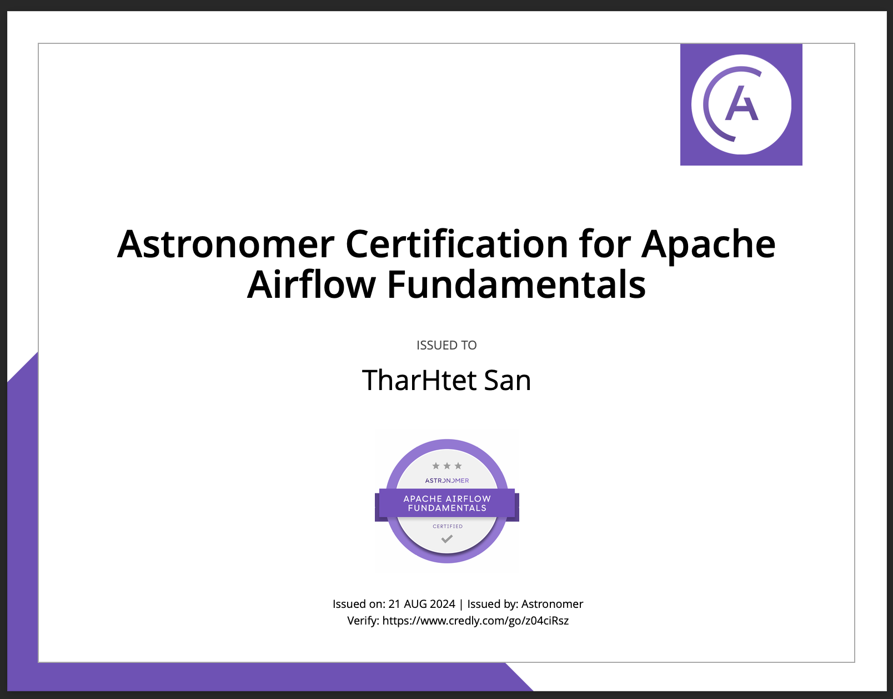

# Airflow Certification Study Guide

Welcome to this repository! Here you'll find resources and tips that helped me pass the Airflow Certification exam. Below is a comprehensive guide to prepare for the exam.

## Exam Details
- **Cost:** $150 USD
- **Passing Score:** Correctly answer 53 out of 75 questions.
- For more information, refer to the [Astronomer exam guide](https://www.astronomer.io/docs/).

## Study Resources
1. **Review DAGs:** Study all DAGs in the [`test_codes`](https://github.com/tharhtetsan/airflow-certification/tree/main/test_codes/dags) folder to understand practical implementations.
2. **Key Topics to Master:**
   - The Airflow UI
   - The Airflow CLI
   - Common Airflow use cases
   - Writing, scheduling, and debugging DAGs
   - DAG dependencies
   - DAG runs
   - Airflow architecture components (e.g., Web Server, Scheduler)
   - Basic Operators (e.g., `PythonOperator`)
   - XCom Basics
   - Connection Basics
   - Variable Basics
   - Sensor Basics
3. **Check Past Questions:** Reviewing [old questions](https://github.com/tharhtetsan/airflow-certification/tree/main/old_querstions) can provide valuable insight into the exam format and content.

## Good Luck!
Wishing you the best of luck in your exam. You've got this!
